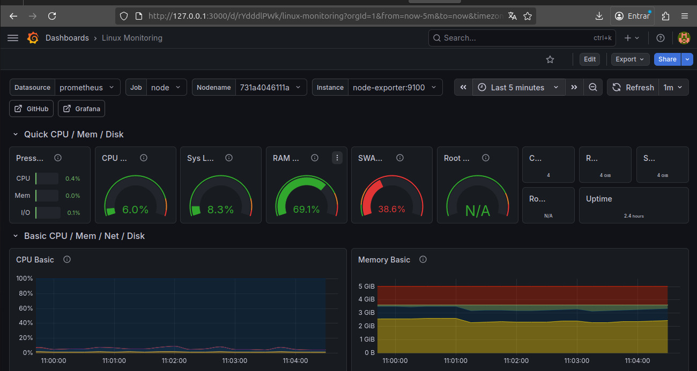
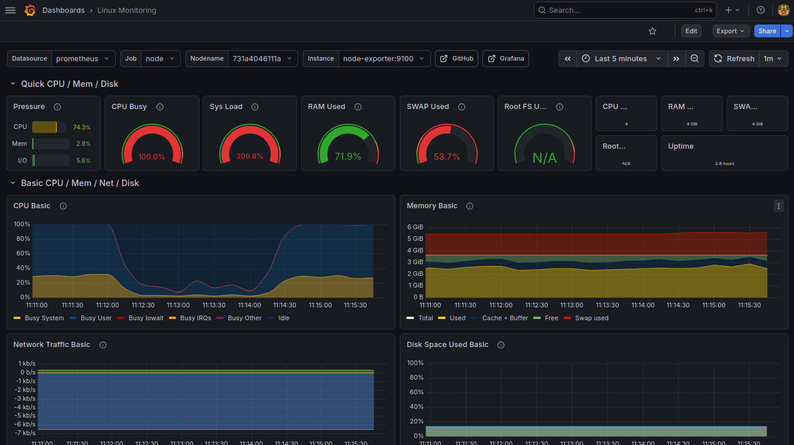

# Laboratorio SRE

Projeto prático de observabilidade utilizando Prometheus, Grafana e Node Exporter em um ambiente Linux conteinerizado com Docker.

---

## Objetivo

Implementar conjunto de ferramentas de monitoramento para simular cenarios que possa encontrar no dia a dia na observabilidade de infraestrutura em abientes como Devops ou SRE.
---

## Tecnologias 

* Linux Ubuntu
* Docker
* Prometheus
* Grafana
* Node Exporter

---

## Arquitetura

Linux Host → Node Exporter → Prometheus → Grafana

---

## Estrutura do Projeto

Lab-Observabilidade-SRE/
│── README.md
│── prometheus/
│   └── prometheus.yml
│── screenshots/
│   └── dashboard.png
│── alertas/
│   └── Alertas futuros.yml

---

## Configuraçoes que foram usadas no Grafana

```yaml
global:
  scrape_interval: 15s

scrape_configs:
  - job_name: 'node'
    static_configs:
      - targets: ['node-exporter:9100']
```

---

### Criando a rede do Docker

```bash
docker network create monitoring
```

### Prometheus

```bash
docker run -d --name prometheus -p 9090:9090 -v $(pwd)/prometheus.yml:/etc/prometheus/prometheus.yml --network monitoring prom/prometheus
```

### Node Exporter

```bash
docker run -d --name node-exporter -p 9100:9100 --network monitoring prom/node-exporter
```

### Grafana

```bash
docker run -d --name grafana -p 3000:3000 --network monitoring grafana/grafana
```

---

## Dashboard 

Grafana Dashboard ID:

1860

---

Após a implantação da estrutura, realizei um teste de estresse para validar o funcionamento do contêiner e a eficácia do monitoramento.

## Teste de Estresse

Generate CPU load:

```bash
stress --cpu 4 --timeout 60
```

Generate memory load:

```bash
stress --vm 2 --vm-bytes 512M --timeout 60
```

---

## Evidencias






---

## Proximos passos

* Criar Alertas de CPU
* Configurar notificações por Email 
* Simular Incidentes

---

## Foco da aprendizagem

* Observability
* Monitoring
* Linux metrics
* Infrastructure troubleshooting
* SRE fundamentals
